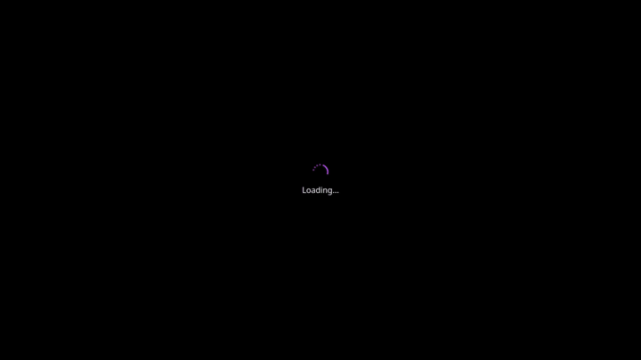

# 🎙️ ElevenLabs Voice App

A modern, elegant text-to-speech application powered by ElevenLabs AI technology. Transform your text into natural-sounding speech with a sleek, user-friendly interface.




## ✨ Features

- 🔄 Real-time text-to-speech conversion
- 🎭 Multiple AI voice options
- 💾 Audio download capability
- 🌓 Dark/Light theme support
- 🎨 Beautiful animations and transitions
- 📱 Responsive design for all devices
- ⚡ Fast and optimized performance

## 🛠️ Technology Stack

### Frontend
- **Framework**: Next.js 14 (React 18)
- **Language**: TypeScript
- **UI Components**: NextUI
- **Styling**: Tailwind CSS
- **Animations**: 
  - Framer Motion
  - Anime.js
  - Custom CSS animations

### Backend
- **Runtime**: Node.js
- **API Integration**: ElevenLabs API
- **HTTP Client**: Axios with custom wrapper
- **Error Handling**: Custom error management system

### Development Tools
- **Package Manager**: npm/pnpm
- **Code Quality**:
  - ESLint
  - TypeScript strict mode
  - Custom error boundaries

## 🚀 Getting Started

1. **Clone the repository**
   ```bash
   git clone [repository-url]
   cd elevenlabs-voice-app
   ```

2. **Install dependencies**
   ```bash
   npm install
   # or
   pnpm install
   ```

3. **Set up environment variables**
   Add your ElevenLabs API key to `.env`

4. **Run the development server**
   ```bash
   npm run dev
   # or
   pnpm dev
   ```

5. **Open your browser**
   Navigate to `http://localhost:3000`

## 🏗️ Project Structure

```
elevenlabs-voice-app/
├── app/                    # Next.js app directory
│   ├── api/               # API routes
│   └── page.tsx           # Main page component
├── components/            # React components
│   ├── VoiceBot/         # Core voice interface
│   └── icons/            # SVG icons
├── styles/               # Global styles and animations
├── utils/                # Utility functions
└── public/              # Static assets
```

## 🔧 Configuration

The application can be configured through various environment variables:

```env
ELEVENLABS_API_KEY=your_api_key
NEXT_PUBLIC_API_URL=your_api_url
```

## 🤝 Contributing

Contributions are welcome! Please feel free to submit a Pull Request.

1. Fork the project
2. Create your feature branch (`git checkout -b feature/AmazingFeature`)
3. Commit your changes (`git commit -m 'Add some AmazingFeature'`)
4. Push to the branch (`git push origin feature/AmazingFeature`)
5. Open a Pull Request

## 📄 License

This project is licensed under the MIT License - see the [LICENSE](LICENSE) file for details.

## 🙏 Acknowledgments

- [ElevenLabs](https://elevenlabs.io/) for their amazing text-to-speech API
- [NextUI](https://nextui.org/) for the beautiful UI components
- The open-source community for various tools and libraries

---

<p align="center">Made with ❤️ by t33n Software</p>